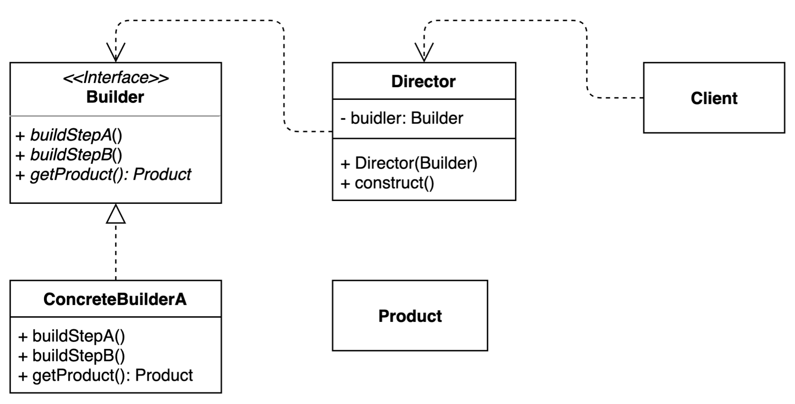

# 빌더 패턴 - Builder Pattern
> 동일한 프로세스를 거쳐 다양한 구성의 인스턴스를 만드는 방법

- 객체를 만드는 프로세스를 독립적으로 분리할 수 있다.

## 3. 장/단점
### 장점
- 객체생성을 제어할 수 있다.
  - 만들기 복잡한 객체를 순차적으로 만들 수 있다.
  - 불완전한 객체를 사용하지 못하도록 방지할 수 있다.
  - 동일한 프로세스를 통해 각기 다르게 구성된 객체를 만들 수 있다.
- 복잡한 객체를 만드는 과정을 숨길 수 있다.

### 단점
- `Builder`, `Director` 와 같이 객체를 추가적으로 생성해야 하므로 약간의 리소스가 든다.
- 객체생성에 관련된 구조가 복잡하다.

## 실무에서의 사용
### Java
- Lombok
- StringBuilder/StringBuffer, Stream

### Spring
- UriComponentsBuilder
- MockMvcWebClientBuilder