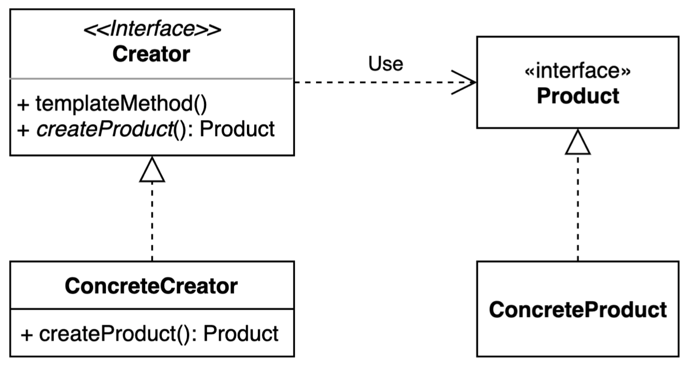

# 팩토리 메소드 패턴 - Factory Method Pattern
> 구체적으로 어떤 인스턴스를 만들지는 서브 클래스가 정한다.  
> 실습 코드 위치 [링크](../../code/src/main/java/creational/factory_method)

- 다양한 구현체(Product)가 있고, 그 중에서 특정한 구현체를 만들 수 있는 다양한 팩토리(Creator)를 제공할 수 있다.
- 어떤 객체를 생성하는 책임을 구체적인 클래스가 아닌 추상적인 인터페이스로 감싸는 것 이다.

이 패턴을 사용하면 객체의 생성을 Creater에 위임하고 클라이언트는 Creator를 통해 객체를 생성한다. 추상화를 통해 기존코드를 변경하지 않고 확장할 수 있으므로 OCP를 지킬 수 있는 패턴이라고 할 수 있다.

#### 구현방법
1. Interface인 `Creator`를 만들고, 
   > Java8에서는 인터페이스에서 구체적인 로직을 작성할 수 있다.
2. `Creator`하위 클래스에서 구체적인 인스턴스를 생성하는 로직을 만든다.
3. 그리고 `Product`를 생성할 때 `Creator`를 사용한다.

## 특징
### 1. 장점
- Creater와 Product간 `느슨한 결합 - loose coupling`으로 변경에는 닫혀있고 확장에는 열려있다.(OCP)
- 기존 코드를 변경하지 않아 코드가 간결해진다.
- 기존 코드가 복잡해지지 않는다.

### 2. 단점
- 각자의 역할을 나누다 보니 클래스가 늘어난다.

## Java와 Spring에서 찾아보는 팩토리 메소드 패턴
### Calender class (Java)
 
### BeanFactory (Spring)