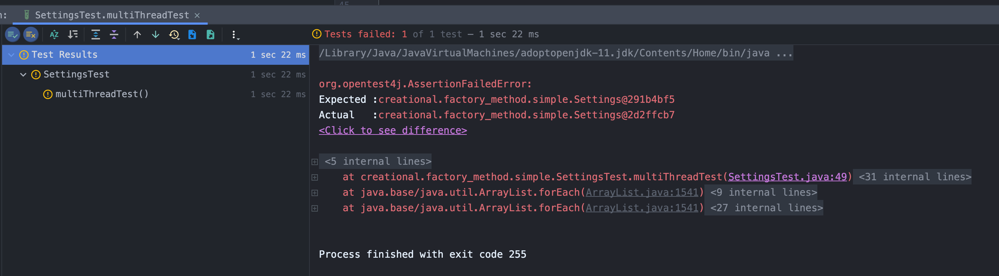
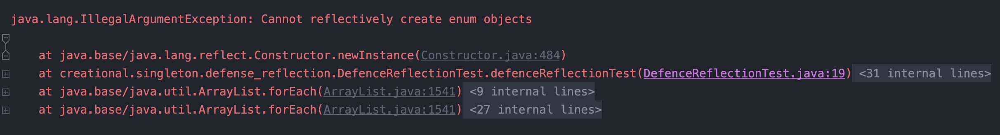

# 싱글톤 패턴 - singleton pattern
> 인스턴스를 오직 한개만 제공하는 클래스

인스턴스를 오직 한개만 만들어 제공하는 클래스가 필요할 때 사용한다.
- 환경세팅에 대한 정보, 시스템 런타임 등...

## 1. 싱글톤 패턴을 가장 단순히 구현하는 방법
> 소스코드: [Settings.java](../../code/src/main/java/creational/singleton/simple/Settings.java)  
> 테스트 코드: [SettingsTest.java](../../code/src/test/java/creational/singleton/simple/SettingsTest.java)

```java
class Settings{

    private static Settings instance;
    
    private Settings(){} // 외부에서 객체를 생성하면 안되기 때문에 private으로 생성자를 만든다.

    public static Settings getInstance(){
        if (instance == null)
            instance = new Settings();

        return instance;
    }
}
```
- 생성자를 private로 만들어 외부에서 객체를 생성할 수 없도록 막았다.
- `getInstance()`를 이용해 외부에서 객체를 받을 수 있다.

junit으로 `Settings.getInstance`가 계속 같은 객체를 반환하는지 테스트 코드를 작성해보면 통과하는 것을 확인할 수 있다.
```java
@Test
public void settingsTest(){
    Settings settings = Settings.getInstance();
    
    assertEquals(settings, Settings.getInstance());
}
```
하지만 이 방법은 단순한 만큼 단점이 존재하는데 멀티 스레드 환경에서는 안전하지 않다.

#### 왜 멀티 스레드 환경에서 안전하지 않을까?
두개의 스레드가 거의 동시에 `getInstance()`를 호출했다고 가정하면,  
if문 속 `instance = new Settings()`가 두 번 호출될 것이고 결과적으로 객체가 2개 생성된다.

이를 테스트 코드로 작성하면
```java
@Test
public void multiThreadTest() throws InterruptedException {
    List<Settings> settingsList = new ArrayList<>();

    Thread a = new Thread(
            () -> settingsList.add(Settings.getInstance())
    );
    Thread b = new Thread(
            () -> settingsList.add(Settings.getInstance())
    );
    Thread c = new Thread(
            () -> settingsList.add(Settings.getInstance())
    );

    a.start();
    b.start();
    c.start();

    Thread.sleep(1000);
    Settings settings1 = settingsList.get(0);
    Settings settings2 = settingsList.get(1);
    Settings settings3 = settingsList.get(2);

    assertEquals(settings1, settings2);
    assertEquals(settings2, settings3);
}
```
1. a, b, c스레드는 모두 `getInstance()`를 호출하여 얻은 `Settings`객체를 `settingsList`에 저장한다.
2. List에 데이터를 모두 저장하기 위해 메인스레드를 1초 멈춘다.
3. 그리고 `settingsList`의 0, 1, 2번째에 저장된 객체가 같은지 확인한다.

**해당 테스트는 상황에 따라 성공할 수 있고 실패할 수 있다.** 그러므로 멀티 스레드 환경에서 싱글톤 객체가 2개 생성 될 수 있으므로 안전하지 않다는 것을 확인할 수 있다.

예시.


## 2. 멀티 스레드 환경에서 안전하게 구현하는 방법
### 2-1. 이른 초기화 - Eager Initialization
> 소스코드 위치 : [EagerInitialization.java](../../code/src/main/java/creational/singleton/threadSafe/EagerInitialization.java)

주로 객체 생성 비용이 적은 경우에 사용한다.
```java
class Settings {

    private static final Settings INSTANCE = new Settings();

    private Settings() {}

    public static Settings getInstance(){
        return INSTANCE;
    }
}
```
- 클래스가 로드되는 시점에 객체가 생성되므로 런타임 시점에서 `thread-safe`하다.

하지만...  
**사용하지 않은 객체를 미리 생성할 수 있으므로 리소스의 낭비될 수 있다.**

### 2-2. `getInstance()`에 synchronized 키워드 사용하기
> 소스코드 위치 : [UseSynchronizedKeyword.java](../../code/src/main/java/creational/singleton/threadSafe/UseSynchronizedKeyword.java)
```java
class Settings{

    private static Settings instance;
    
    private Settings(){} 

    public static synchronized Settings getInstance(){
        if (instance == null)
            instance = new Settings();

        return instance;
    }
}
```
자바의 `synchronized`키워드를 추가한 `getInstance()`를 호출하면 해당 메서드에 `락 - lock`을 걸어 **처음 접근한 쓰레드 이외의 다른 스레드가 접근할 수 없도록 하여** `thread-safe`한 싱글톤 객체를 만들 수 있다.

하지만...  
**`getInstance()`를 호출할 때 매번 락이 걸리므로 성능상 그렇게 좋지는 않다.**

### 2-3. Double Checked Locking 사용하기
> 소스코드 위치 : [DoubleCheckedLocking.java](../../code/src/main/java/creational/singleton/threadSafe/DoubleCheckedLocking.java)
`synchronized`블럭 전에 한번 체크하고 `synchronized`후에 한번 더 체크하는 방법이라 Double Checked Locking이라고 불린다.

```java
class Settings {

    private static volatile Settings instance;

    private Settings() {}

    public static Settings getInstance(){
        if(instance == null){
            synchronized (Settings.class) {
                if(instance == null){
                    instance = new Settings();
                }
            }
        }
        return instance;
    }
}
```
`getInstance()`에 synchronized 키워드를 사용한 방법보다 Double Checked Locking방법이 효율적이다. 그 이유는 
- 매번 호출할 때 락이 걸리는 것이 아닌 instance가 null일 때 락이 걸리므로 [2-2](#2-2-getinstance에-synchronized-키워드-사용하기)방법 보다 효율적이다.

하지만...  
- 코드가 복잡해진다.
- 코드가 복잡한 만큼 이 코드의 동작 원리도 복잡하다.
  > instance 전역 변수에 `volatile`키워드를 사용했는지에 대한 이유를 이해 하려면 Java1.4이하 버전이 메모리/멀티스테드를 다루는 방법에 대해 알아야 한다.
- 해당 코드는 Java1.5 부터 동작한다.

### 2-4. static inner class 사용하기
> 소스코드 위치 : [UseStaticInnerClass.java](../../code/src/main/java/creational/singleton/threadSafe/UseStaticInnerClass.java)
```java
class Settings {
    
    private Settings() {}

    private static final class InstanceHolder {
        private static final Settings instance = new Settings();
    }

    public static Settings getInstance(){
        return InstanceHolder.instance;
    }
}
```
static inner class는 호출하는 시점에 클래스가 로딩이 되는 성질을 이용해 싱글톤을 구현할 수 있다.
- 가장 권장하는 방법이다.

## 3. 싱글톤 패턴을 무너뜨리는 방법 - Reflection
### 3-1. 리플렉션
> Settings클래스 : [Settings.java](../../code/src/main/java/creational/singleton/destroy_singleton/Settings.java)  
> 테스트 코드: [DestroySingletonTest](../../code/src/test/java/creational/singleton/destroy_singleton/DestroySingletonTest.java)

다음과 같은 싱글톤 객체의 코드가 있을 때 
```java
class Settings {
    
    private Settings() {}

    private static final class InstanceHolder {
        private static final Settings instance = new Settings();
    }

    public static Settings getInstance(){
        return InstanceHolder.instance;
    }
}
```
리플렉션을 이용해 다른 객체를 생성하는 테스트 코드를 작성하면
```java
@Test
public void useReflection() throws NoSuchMethodException, InvocationTargetException, InstantiationException, IllegalAccessException {
    final Settings settings = Settings.getInstance();

    final Constructor<Settings> settingsConstructor = Settings.class.getDeclaredConstructor();
    settingsConstructor.setAccessible(true);
    Settings reflectionSettings = settingsConstructor.newInstance();

    Assertions.assertNotEquals(settings, reflectionSettings);
}
```
일반적으로 얻은 `Settings`객체와 리플렉션으로 생성한 객체는 다르므로 테스트가 통과하게 된다. 

### 3-2. 직렬화 & 역직렬화
Java에서는 클레스에 `Serializable` 을 `구현 - implements`하면 직렬화/역직렬화가 가능하다. **객체를 역직렬화하면 기존과 다른 새로운 객체를 생성하게 된다.** 이러한 성질을 이용해서 싱글톤을 무너뜨려보자!
 
먼저 Settings에 `Serializable`를 implements하자
```java
class Settings implements Serializable {
    ... // 3-1 리플렉션 예제와 같다.
}
```
1. 직렬화로 객체를 파일로 저장한 후 
2. 그 파일을 읽어 역직렬화를 수행한다.
3. 그리고 원본 객체와 역직렬화를 통해 얻은 객체를 비교해보자

```java
@Test
public void useSerializeAndDeserialize() throws IOException, ClassNotFoundException {
    Settings settings = Settings.getInstance();

    Settings serializeAndDeserializeSettings = null;

    try (ObjectOutput out = new ObjectOutputStream(new FileOutputStream("settings.obj"))){
        out.writeObject(settings);
    }

    try(ObjectInput in = new ObjectInputStream(new FileInputStream("settings.obj"))){
        serializeAndDeserializeSettings = (Settings) in.readObject();
    }

    assertNotEquals(settings, serializeAndDeserializeSettings);
}
```
두 개의 객체가 다르므로 테스트가 성공한다.

#### 그럼 어떻게 이 방법을 막을 수 있을까?
리플렉션과 다르게 해당 방법은 충분히 막을 수 있다. 바로 직렬화/역직렬화를 수행할 싱글톤 클래스에 `protected Object readResolve()`의 메서드 시그니처를 가진 메서드를 직접 구현하면 된다.

```java
class Settings implements Serializable {

    private Settings() {}

    private static final class InstanceHolder {
        private static final Settings INSTANCE = new Settings();
    }

    public static Settings getInstance(){
        return Settings.InstanceHolder.INSTANCE;
    }

    protected Object readResolve(){
        return getInstance();
    }
}
```
위에 코드처럼 `readResolve()`메서드를 구현하고, 위 테스트 코드(`useSerializeAndDeserialize()`)를 실행하면 역직렬화를 진행한 객체가 처음 생성한 객체와 같게 되므로 테스트가 실패하게된다.

## 4. 리플렉션이 무너뜨릴 수 없는 싱글톤 구현 방법
> 소스코드 : [Settings.java](../../code/src/main/java/creational/singleton/defense_reflection/Settings.java)  
> 테스트코드 : [DefenceReflectionAndSerializationAndDeserializeTest.java](../../code/src/test/java/creational/singleton/defense_reflection/DefenceReflectionAndSerializationAndDeserializeTest.java)

앞에서 구현한 싱글톤은 멀티 스레드 환경에서 안전하지만, 모두 리플렉션이라는 엄청난 기능에 무너질 수 있다. 이는 `enum`을 사용해 리플렉션을 이용한 조작을 막을 수 있다.

```java
enum Settings{

    INSTANCE

}
```
이렇게 싱글톤을 쉽게 구현했다. enum은 class기반이므로 여기에 메서드 추가와 같이 여러 작업을 하면 된다!

#### Settings enum의 생성자를 확인해보자
바이트 코드를 통해 `Settings` enum의 생성자를 확인해보면
> intellj byte code 확인방법
> - Shift 2번 &rarr; show bytecode 검색 및 엔터
> - View &rarr; Show Bytecode 선택


```java
    ...

  // access flags 0x2
  // signature ()V
  // declaration: void <init>()
  private <init>(Ljava/lang/String;I)V
   L0
    LINENUMBER 3 L0
    ALOAD 0
    ALOAD 1
    ILOAD 2
    INVOKESPECIAL java/lang/Enum.<init> (Ljava/lang/String;I)V
    RETURN
   L1
    LOCALVARIABLE this Lcreational/singleton/defense_reflection/Settings; L0 L1 0
    MAXSTACK = 3
    MAXLOCALS = 3

    ...
```
인자로 `String`타입을 받는 생성자가 있는 것을 볼 수 있다. 

이제 생성자의 정보를 알았으니 리플렉션으로 `Settings`객체를 생성하려고 시도해보자! `IllegalArgumentException`이 발생한다.
```java
@Test
public void defenceReflectionTest() throws InvocationTargetException, InstantiationException, IllegalAccessException, NoSuchMethodException {
    Settings settings = Settings.INSTANCE;

    Settings settingsReflection = null;
    final Constructor<Settings> constructor = Settings.class.getDeclaredConstructor(String.class);
    constructor.setAccessible(true);

    settingsReflection = constructor.newInstance("INSTANCE"); // IlleaglArgumentException발생

    Assertions.assertNotEquals(settings, settingsReflection);
}
```


이렇게 enum은 리플렉션을 통한 조작을 할 수 없다. 그 이유는 `constructor.newInstance("INSTANCE")` 부분에서 `newInstance`내부를 확인해보면 다음과 같은데 `modifier`가 enum이면 객체를 생성할 수 없도록 막혀있다.
```java
@CallerSensitive
@ForceInline // to ensure Reflection.getCallerClass optimization
public T newInstance(Object ... initargs)
    throws InstantiationException, IllegalAccessException,
            IllegalArgumentException, InvocationTargetException
{
    if (!override) {
        Class<?> caller = Reflection.getCallerClass();
        checkAccess(caller, clazz, clazz, modifiers);
    }
    if ((clazz.getModifiers() & Modifier.ENUM) != 0)
        throw new IllegalArgumentException("Cannot reflectively create enum objects");
    ConstructorAccessor ca = constructorAccessor;   // read volatile
    if (ca == null) {
        ca = acquireConstructorAccessor();
    }
    @SuppressWarnings("unchecked")
    T inst = (T) ca.newInstance(initargs);
    return inst;
}
```

#### 그럼 직렬화/역직렬화를 통한 조작은 어떻게 싱글톤을 무너뜨리지 않을 수 있었을까?
Settings의 bytecode를 다시한번 살펴보면 맨 윗줄의 선언부를 봐보자
```java
final enum creational/singleton/defense_reflection/Settings extends java/lang/Enum {

    ...etc

}
```
자바의 enum은 내부적으로 `java.lang.Enum`를 상속받고 있다. 그리고 final로 선언되어 있다.  
여기서 `java.lang.Enum`을 살펴보면
```java
public abstract class Enum<E extends Enum<E>>
        implements Comparable<E>, Serializable {

    ...etc

}
```
Enum 클레스에서 `Serializable`를 구현하여 직렬화에 안전하다. 테스트 코드를 작성해서 확인해보자!
```java
@Test
public void useSerializeAndDeserialize() throws IOException, ClassNotFoundException {
    Settings settings = Settings.INSTANCE;

    Settings serializeAndDeserializeSettings = null;

    try (ObjectOutput out = new ObjectOutputStream(new FileOutputStream("settings.obj"))){
        out.writeObject(settings);
    }

    try(ObjectInput in = new ObjectInputStream(new FileInputStream("settings.obj"))){
        serializeAndDeserializeSettings = (Settings) in.readObject();
    }

    assertEquals(settings, serializeAndDeserializeSettings);
}
```


### enum을 이용한 싱글톤의 단점
- enum은 상수의 성질을 가지고 있다. 즉, 런타임시점이 아닌 클래스로더가 클래스를 로드하는 시점에 만들어지므로 
이른 초기화가 된다.
- enum은 내부적으로 final로 선언되므로 상속을 이용한 방법을 사용할 수 없다.
  > 그럼 무난하게 홀더를 사용하면 된다.

## 4. 실무에서는 어떻게 사용될까?
- Spring의 Bean scope중 싱글톤
  > Java와 Spring에서의 싱글톤 차이점은 객체의 생명주기가 다르다, Java는 `Class loader`기준, Spring에서는 `ApplicationContext`가 기준이 된다.
- `java.lang.Runtime`
- 여러 디자인 패턴들의 구현체의 일부로 사용된다.
  > 빌더, 퍼사드, 추상 팩토리 등...
