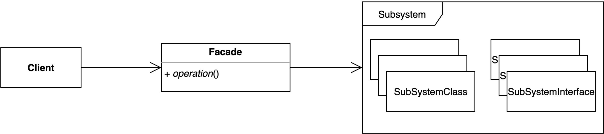

# 퍼사드 패턴 - Facade Pattern
복잡한 서브 시스템의 의존성을 최소화하는 방법
> *서브 시스템: 라이브러리 또는 프래임워크를 의미한다.



## 특징
### 장점
- 서브 시스템에 대한 의존성을 한 곳으로 모을 수 있다.

### 단점
- 퍼사드 클래스가 서브 시스템에 대한 모든 의존성을 가지게 된다.

## 실무에서의 Facade Pattern 적용
사람의 관점에 따라서 달라질 수 있다.
- Spring의 `MailSender`, `platformTransactionManager`

이 이외에 Spring MVC는 자바가 제공하는 servlet를 감쌀 수 있고, webflux를 감쌀 수 있다 하지만, 이러한 servlet과 webflux모두 SpringMVC의 기능을 그대로 사용할 수 있으므로 일종의 거대한 퍼사드 패턴이 될 수 있다. - 백기선

## 퍼사드 패턴 적용기
[HiRecruit](https://github.com/themoment-team/HiRecruit-server)라는 프로젝트에서 OAuth2인증을 하기 위해 `Sping Security OAuth2 Clienrt`를 사용하고 있어 `OAuth2UserService<OAuth2UserRequest, OAuth2User>`를 상속받은 후 인증관련 코드를 작성했다.

```kotlin
@Service
class CustomOAuth2UserService(
    private val userAuthService: UserAuthService,
    private val userRegistrationService: UserRegistrationService,
    private val workerRepository: WorkerRepository
) : OAuth2UserService<OAuth2UserRequest, OAuth2User> {

    private var delegateOauth2UserService: OAuth2UserService<OAuth2UserRequest, OAuth2User> = DefaultOAuth2UserService()

    /**
     * OAuth2인증/인가를 진행합니다.
     * @throws OAuth2AuthenticationException OAuth2 인증/인가가 실패할경우 발생합니다.
     */
    override fun loadUser(userRequest: OAuth2UserRequest): OAuth2User {
        val oAuth2User : OAuth2User =  delegateOauth2UserService.loadUser(userRequest)
        val registrationId : String = userRequest.clientRegistration.registrationId
        val userNameAttributeName : String = userRequest.clientRegistration
            .providerDetails
            .userInfoEndpoint
            .userNameAttributeName

        val oAuthAttributes = OAuthAttributes.of(
            registrationId,
            userNameAttributeName,
            oAuth2User.attributes
        )

        // 첫 사용자라면 계정을 등록한다.
        if(workerRepository.existsByGithubId(oauthAttributes.id))
            userRegistrationService.registration(oauthAttributes)

        val loginUser : User = userAuthService.authentication(oauthAttributes)

        return DefaultOAuth2User(
            Collections.singleton(SimpleGrantedAuthority(loginUser.role.role)),
            oAuthAttributes.attributes,
            oAuthAttributes.userNameAttributeName
        )
    }
}
```

코드를 보면 `delegateOauth2UserService`를 통해 OAuth2로 로그인한 유저의 정보를 가져오고 그 정보를 가지고 `userAuthService.authentication(oauthAttributes)`구문을 통해 인증을 진행한다. 만약 OAuth2로그인이 처음이라면 주석에 나와있듯이 계정을 서버에 등록한다.

### 해당 코드의 개선할 사항
```kotlin
if(workerRepository.existsByGithubId(oauthAttributes.id))
    userRegistrationService.registration(oauthAttributes)

val loginUser : User = userAuthService.authentication(oauthAttributes)
```
- 만약 비즈니스 요구사항으로 인해 인증로직을 변경하게 된다면 client코드인 `CustomOAuth2UserService.loadUser`메서드를 수정해야 한다.
    > 이는 변경에 열려 있으므로 OCP에 위배된다.
- 저 3줄을 위해 3개의 의존성이 필요하다.
  > `WorkerRepository`, `UserRegistrationService`, `UserAuthService`

이러한 단점을 보완하기 위해 퍼사드 패턴을 이용한 리펙토링을 진행하게 되었다.

#### 1. Facade Pattern에 사용될 interface생성
위 3줄의 코드는 OAuth 인증절차를 실행하는 코드이다 이를 그대로 퍼사드 페턴에 옮길 예정이므로 interface의 이름을  `OAuthProcessorFacade`라 지었다.
> 뒤에 접미사로 Facade를 붙인 이유는 퍼사드 패턴을 직관적으로 파악하기 위함이다.
```kotlin
/**
 * OAuth 인증에 관련된 로직을 실행하는 퍼사드 패턴입니다.
 *
 * @see CustomOAuth2UserService
 * @author 정시원
 * @version 1.0
 */
interface OAuthProcessorFacade {

    /**
     * 유저의 로그인(인증)/회원가입을 담당합니다.
     *
     * @param [User] 인증에 성공한 User 객체입니다.
     * @throws OAuth2AuthenticationException 인증에 실패할 경우 발생합니다.
     */
    fun process(oauthAttributes : OAuthAttributes) : User
}
```

그 후 `CustomOAuth2UserService`를 `OAuthProcessorFacade`인터페이스에 의존하게 하고 다음 코드와 같이 변경을 하게 하면
```kotlin
@Service
class CustomOAuth2UserService(
    private val oAuthProcessorFacade: OAuthProcessorFacade, // 의존성이 1개로 줄어들었음!
) : OAuth2UserService<OAuth2UserRequest, OAuth2User> {

    private var delegateOauth2UserService: OAuth2UserService<OAuth2UserRequest, OAuth2User> = DefaultOAuth2UserService()

    /**
     * OAuth2인증/인가를 진행합니다.
     * @throws OAuth2AuthenticationException OAuth2 인증/인가가 실패할경우 발생합니다.
     */
    override fun loadUser(userRequest: OAuth2UserRequest): OAuth2User {
        val oAuth2User : OAuth2User =  delegateOauth2UserService.loadUser(userRequest)
        val registrationId : String = userRequest.clientRegistration.registrationId
        val userNameAttributeName : String = userRequest.clientRegistration
            .providerDetails
            .userInfoEndpoint
            .userNameAttributeName

        val oAuthAttributes = OAuthAttributes.of(
            registrationId,
            userNameAttributeName,
            oAuth2User.attributes
        )

        val loginUser : User = oAuthProcessorFacade.process(oAuthAttributes) // 여기! 한줄로 끝남

        return DefaultOAuth2User(
            Collections.singleton(SimpleGrantedAuthority(loginUser.role.role)),
            oAuthAttributes.attributes,
            oAuthAttributes.userNameAttributeName
        )
    }
}
```
`CustomOAuth2UserService`기존보다 의존성이 3개에서 1개로 줄어들고 클라이언트 자체 코드도 줄어들었다.

#### 2. OAuthProcessorFacade 인터페이스 구현하기
이제 `OAuthProcessorFacade`를 구현해보자
```kotlin
@Service
class OAuth2ProcessorFacadeImpl(
    private val workerRepository: WorkerRepository,
    private val userRegistrationService: UserRegistrationService,
    private val userAuthService: UserAuthService
) : OAuthProcessorFacade {

    override fun process(oauthAttributes: OAuthAttributes): User {
        // 첫 사용자라면 계정을 등록한다.
        if(workerRepository.existsByGithubId(oauthAttributes.id))
            userRegistrationService.registration(oauthAttributes)

        return userAuthService.authentication(oauthAttributes)
    }
}
```
퍼사드의 구현체인 `OAuth2ProcessorFacadeImpl`에 의존성을 한곳에 몰아넣고 그 문제의 3줄을 여기에다가 붙어넣었다.

이렇게 간단하게 퍼사드 패턴을 구현했다.

만약 OAuth에 인증 로직(`OAuth2ProcessorFacadeImpl.process`)를 다른 로직으로 바꾸고 싶다면, 다른 서브 클래스를 만들어 `OAuth2ProcessorFacadeImpl`를 대체하면 끝난다.