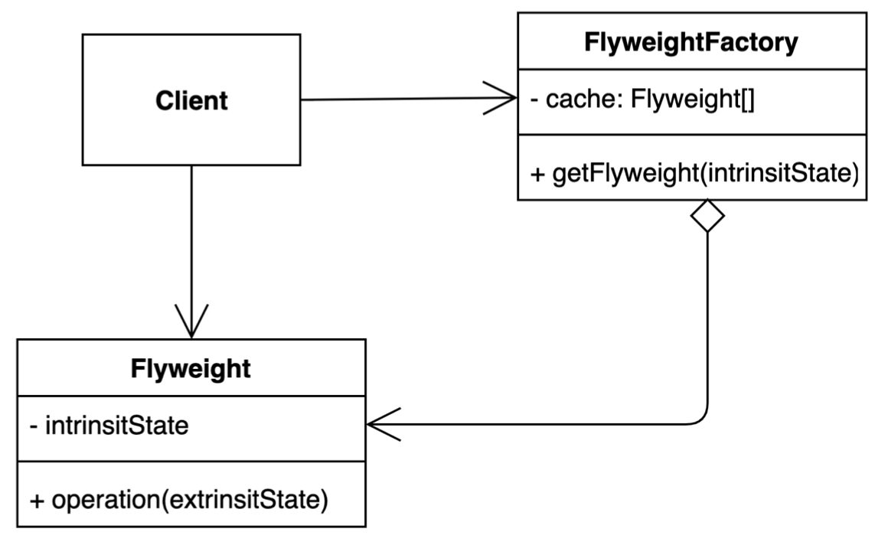

# 플라이웨이트 패턴 - Flyweight Pattern
> 객체를 가볍게 만들어 메모리 사용을 줄이는 패턴

- 자주 변하는 속성(외적인 속성, extrinsit)과 변하지 않은 속성(내적인 속성, intrinsit)을 분리하고 재사용하여 메모리 사용을 줄일 수 있다.
    > 자주 변하는 속성은 주관적이라 정답이 따로 없다.
- 캐시와 비슷하다.

#### 플라이웨이트 패턴의 주의사항
**플라이웨이트에 해당하는 인스턴스는 `Immutable` 해야한다.**  
왜냐하면 플라이웨이트에 해당하는 extrinsit한 데이터를 가지고 있는 인스턴스는 공유될 인스턴스이기 때문에 어느 한 곳에서 데이터가 바뀐다면 해당 인스턴스를 사용하는 모든 곳에 영향이 미친다.

## 장/단점
### 장점
- 애플리케이션에서 사용하는 메모리를 줄일 수 있다.

### 단점
- 코드의 복잡도가 증가한다.